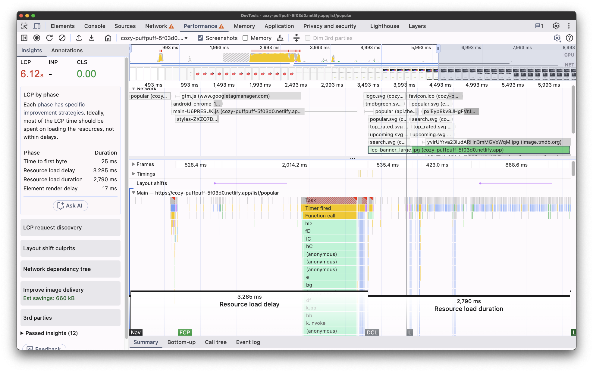
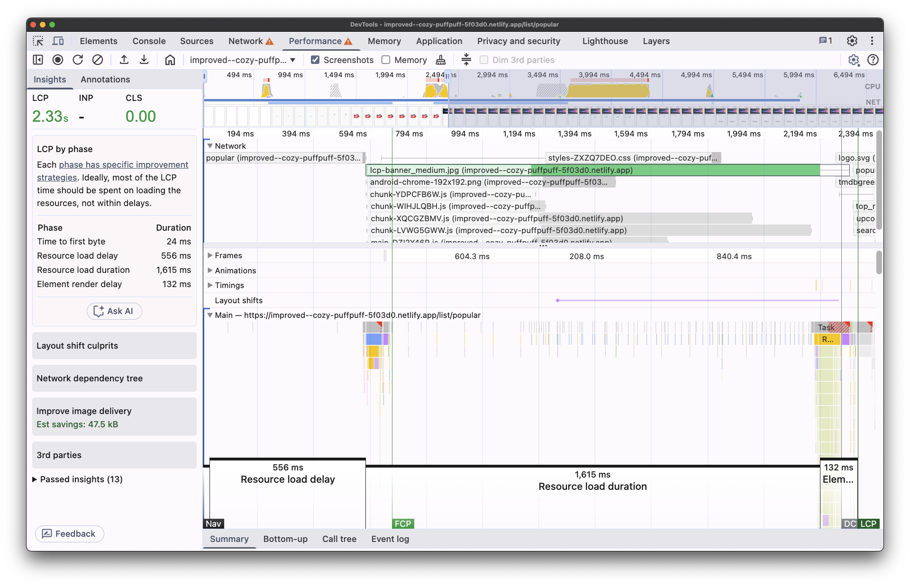

# LCP Optimization Demo

A demo project showcasing **Largest Contentful Paint (LCP)** optimization techniques and their impact.

This project demonstrates the transformation of a poorly performing web application into a highly optimized one, 
focusing specifically on LCP improvements. The demo includes before/after states with detailed performance measurements and optimization strategies.

## Results

- **Initial State**: ~6.1 seconds LCP ❌
- **Optimized State**: ~2.3 seconds LCP ✅
- **Improvement**: 62% reduction in LCP time

### Before Optimization

*LCP: ~6.1 seconds - Poor performance baseline*

### After Optimization

*LCP: ~2.3 seconds - Optimized performance*

## 🚀 Live Demos

| Version       | URL                                                                          | Description                        |
|---------------|------------------------------------------------------------------------------|------------------------------------|
| **Original**  | [View Demo](https://cozy-puffpuff-5f03d0.netlify.app/list/popular)           | Unoptimized baseline with poor LCP |
| **Optimized** | [View Demo](https://improved--cozy-puffpuff-5f03d0.netlify.app/list/popular) | Fully optimized with excellent LCP |

## 📊 Measurements & Improvements

### Testing Environment

| Component      | Specification          |
|----------------|------------------------|
| **Device**     | MacBook Pro 14" M4 Max |
| **Browser**    | Chrome                 |
| **Network**    | Slow 4G throttling     |
| **CPU**        | 4x throttling          |
| **Simulation** | Samsung Galaxy S8      |

### 0. Initial State Analysis
- **Baseline Measurement**: [Performance Profile](./measurements/0-original.json)

### 1. LCP Image Preloading
- **Strategy**: Preload critical above-the-fold images
- **Implementation**: [View Commit](https://github.com/hoebbelsB/lcp-demo/commit/f2b06d17d627173478ba86328633d072defae46f)
- **Results**: [Performance Profile](./measurements/1-improved_prefetch-lcp.json)

### 2. Asset Optimization
- **Strategy**: Implement responsive images with srcset
- **Implementation**: [View Commit](https://github.com/hoebbelsB/lcp-demo/commit/e92abe8bb2e87c6285620c85b813afb583a01c1f)
- **Results**: [Performance Profile](./measurements/2-improved_srcset-lcp.json)

### 3. Third-Party Script Optimization
- **Strategy**: Delay non-critical third-party scripts
- **Implementation**: [View Commit](https://github.com/hoebbelsB/lcp-demo/commit/74c3e701cd063bc77c89e21cae4a27597297b296)
- **Results**: [Performance Profile](./measurements/3-improved_3rd-party-delay.json)

### 4. Bundle Size Optimization
- **Strategy**: Code splitting and tree shaking
- **Implementation**: [View Commit](https://github.com/hoebbelsB/lcp-demo/commit/67ac10dcd5acdcd791578c0df2264343df1d9c94)
- **Results**: [Performance Profile](./measurements/4-improved_bundle-size.json)
